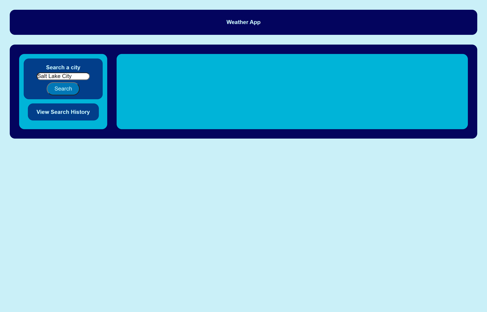
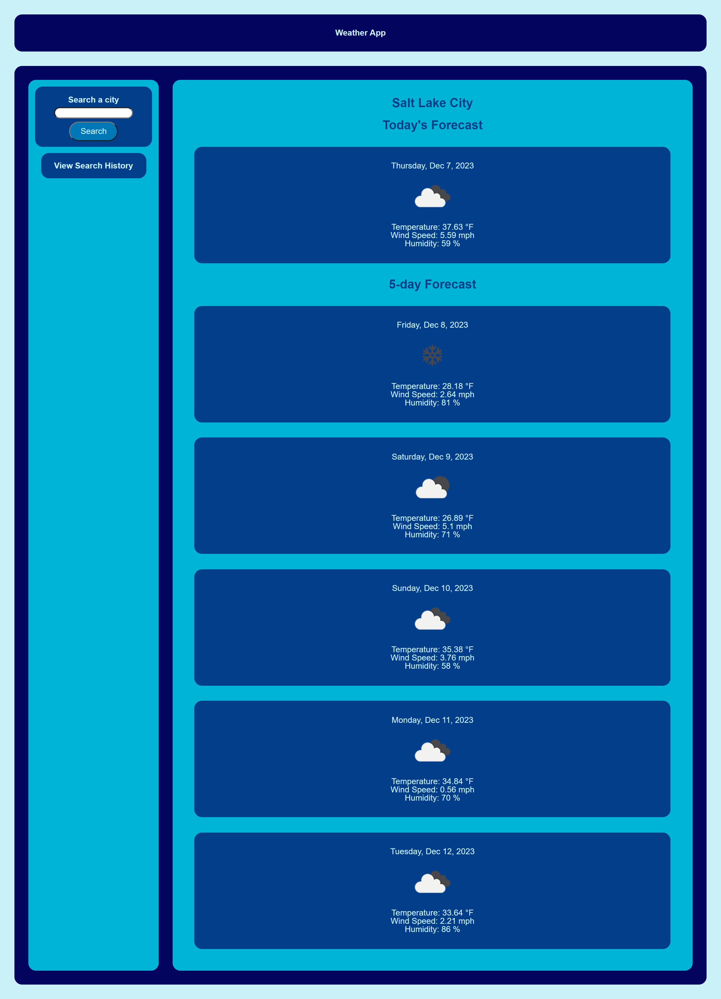

# Weather-App

## Description

As a person who is affected by the weather, I want and application that can give me a weather forecast so I can plan ahead.

Building this app gives me the opportunity to learn more about communicating with server-side APIs and using data from those APIs.

## Usage

Navigate to the [Weather App webpage](https://wmr89.github.io/weather-app/).

Search a city by name in the search bar.

Click the "Search" button and the 5-day weather forecast for your city will appear. The forecast will show temperature, humidity, and wind speed.

Once you have search for a city it will be logged in your history so you can search it again easily. You can also delete a City from your history if needed.

## Credits

https://openweathermap.org/

## License
See LICENSE in the REPO
